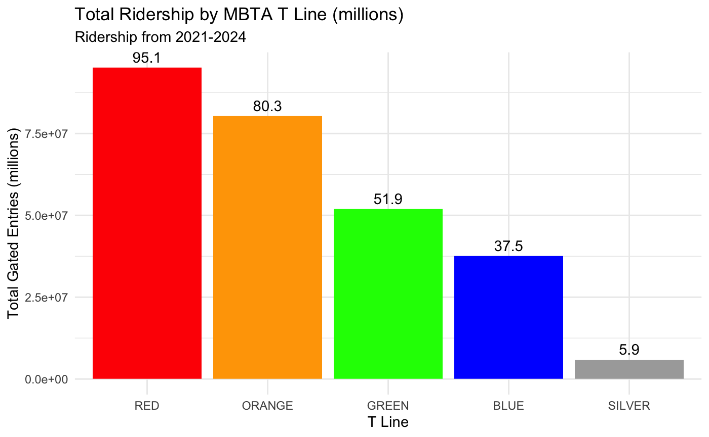
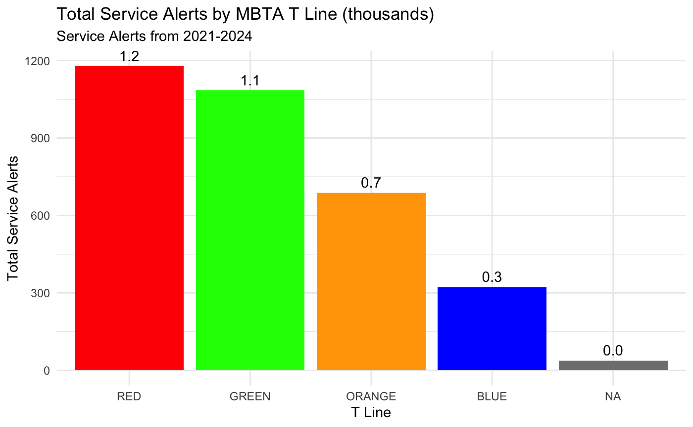
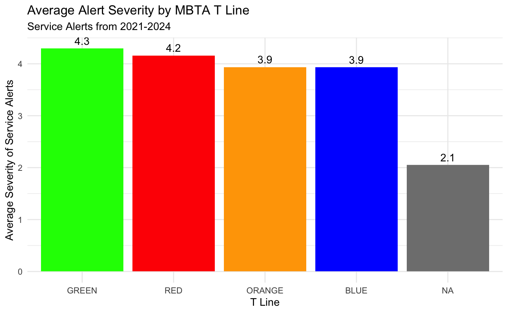
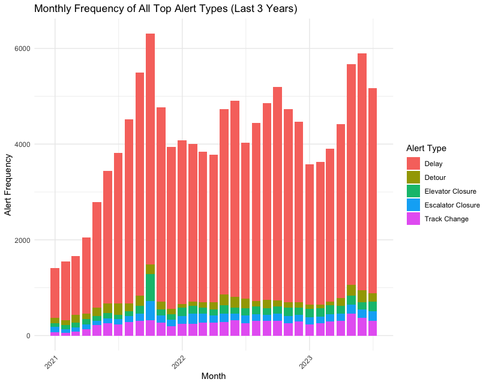
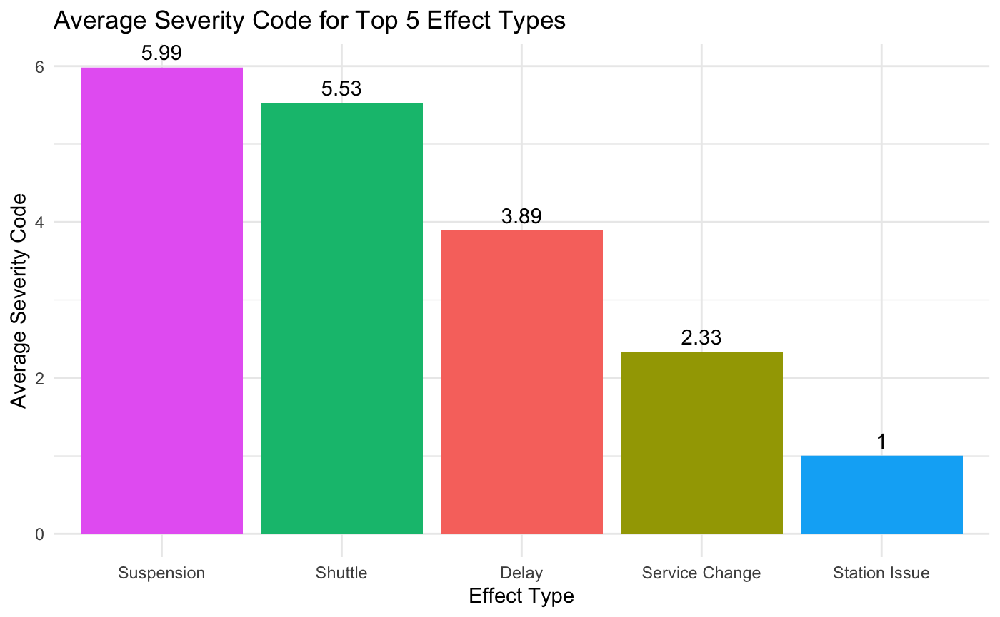
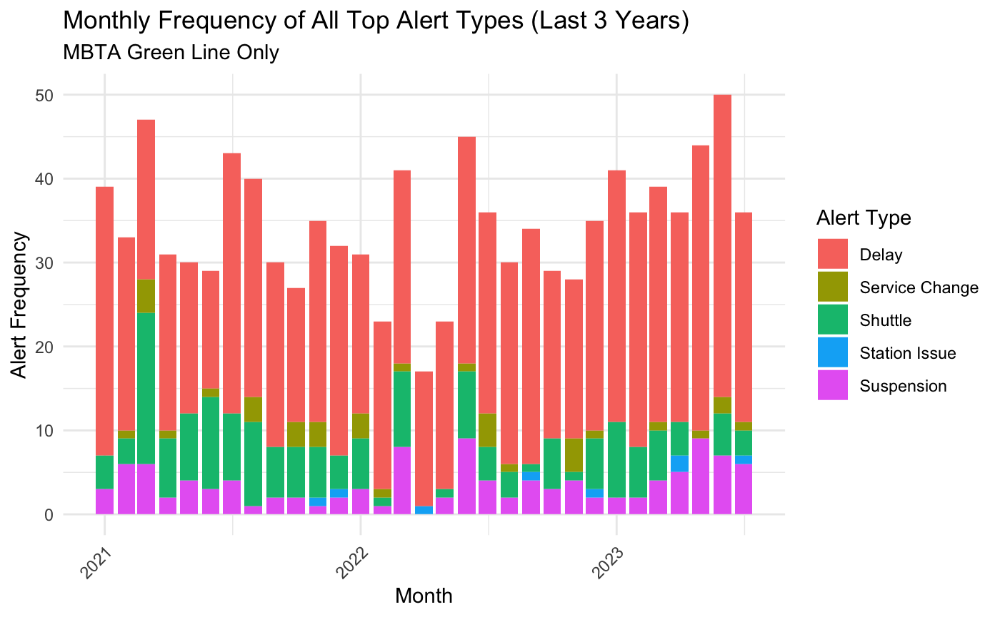
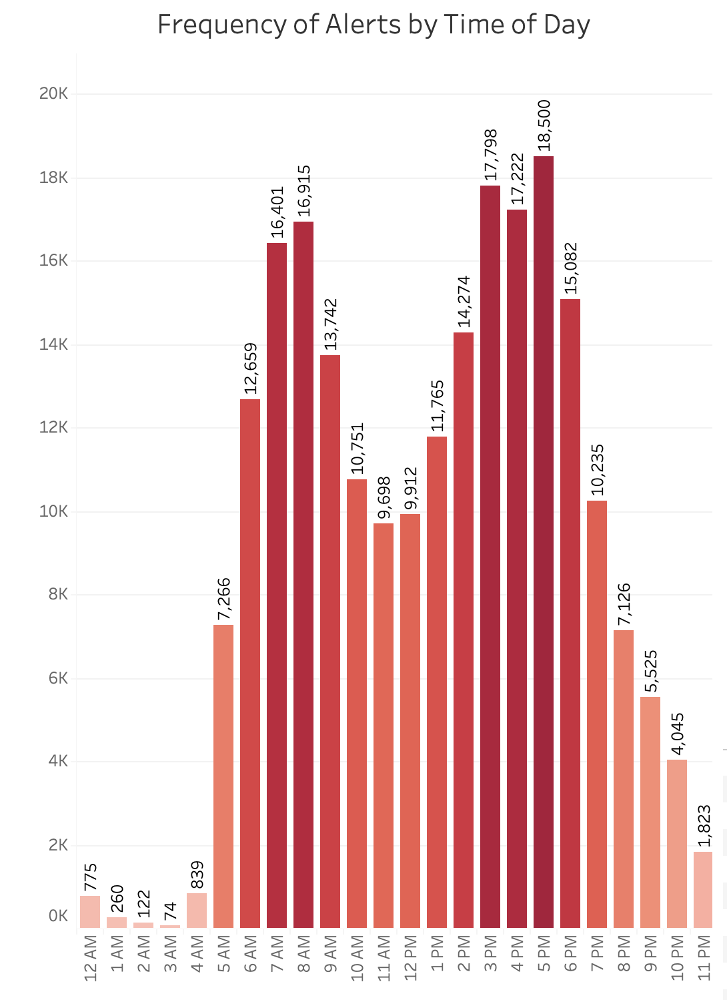

# Fall-2024-Group-2
Repository for Fall 2024 Software Tools for Data Analysis Group Project
Group Members: Angelo Nicolosi, Brian Sok, Ryan Kantor, & Christina Wright

### Introduction
The current sentiment of Boston commuters on the Massachusetts Bay Transportation Authority (MBTA) is often quite negative. This past year, many lines have faced unexpected shutdowns, forcing commuters to seek out alternate forms of transportation. In a survey from Boston.com earlier this year, nearly 80% of commuters reported their daily commute on the MBTA as being a poor experience (https://www.boston.com/community/readers-say/green-line-january-2024-commute-readers-say/). As a team of analysts, we have dove deep into the ridership and performance data to provide the MBTA with key insights and recommendations on how they can improve the experience of their customers and regain trust for their commutes.

For this analysis, our primary stakeholder is the Massachusetts Department of Transportation, and more specifically the Massachusetts Bay Transportation Authority (MBTA). The decision to be made here is where should the government invest in performance improvements of the T system to make the largest impact on their commuters, and rebuild the reputation of the MBTA.

### Data Summary
To conduct this analysis, we used two main categories of data, both publically available on the MBTA's Blue Book Open Data Portal (https://mbta-massdot.opendata.arcgis.com). First, we looked at the ridership data - specifically the MBTA historical gate station entries (https://mbta-massdot.opendata.arcgis.com/datasets/7859894afb5641ce91a2bb03599fdf5b/about). Then, we analyzed this against the service alerts (https://mbta-massdot.opendata.arcgis.com/datasets/90ed9092bd7a4285b296d5ff938edf29_0/explore). During this specific timeframe, the MBTA had 280,907,779  gated entries recorded and  127,080 service alerts across all modes of transportation in their system which includes, bus, commuter rail, and subway. There were 3,312 subway alerts observed from the data. Along with gated entries and service alert counts, our team looked at the causes and locations of these subway alerts, in order to identify any trends occurring within the subway system. The MBTA is able to categorize alert data by cause_name, effect_name, cause_code, and effect_code this data is central to our analysis. 

To better use this raw data, we first cleaned it and then filtered and aggregated it on monthly levels (with the exception of keeping service alerts on the alert level too). These data sources are now on our github:
1. Monthly_Ridership.csv --> monthly gated entry numbers
2. Monthly_ServiceAlerts.csv --> monthly serive alert numbers
3. Alerts_Ridership_BySubwayLine.csv --> merged data set of both gated entries & alerts
4. ServiceAlerts_AlertLevel_BySubwayLine.csv --> alert level data with alert metadata

The code for preparing these datasets for analysis is contained in the file CleaningRawDataFromMBTA.Rmd on this branch. This file does require downloading the raw CSVs from the MBTA (link provided within the markdown) since the files were too large to upload to github. 

### Data Analytics

#### Preliminary Analysis: Green Line has suffered the most severe service disruptions over the past 3 years, showing signs of suboptimal ridership
First, it is important to establish a strong understanding of which MBTA subway line has had the largest shares of ridership, and how each line compares to one another. Shown in the plot below, we can see the Red line is by far the most popular, followed by the orange, green, blue, then silver lines.

When we consider the same time period, but instead look at the total number of service alerts by T line - there is an interesting shift in ranking between the Orange and Green lines. While the Red line remains most popular for ridership despite the highest number of alerts, we see that the Green line comes in second for most alerts. However, in the previous plot, it is notable that the Green line is well behind the Orange line for ridership.

High-level data suggests that the Green line suffered from the most severe service alerts over this time period. When looking at the average severity of the alerts, logged on a scale of 1-10, where highest score equates to being most severe - the Green line takes the first position.

#### Deep Dive: Service alerts for delays are most disruptive from a volume perspective, while suspensions & shuttles are most severe
From a general perspective, we can see that for subway alerts, delays are by far the most popular.

Looking at the average severity by these different alert types, suspensions and replacing the T with shuttle busses fall as the most servere type of service disruption.

Diving deeper into the softness in ridership on the Green line, potentially due to increased service alerts - we see in the plot below that the Green line shows much higher share of suspensions and shuttle bus service than the overall MBTA (graph above). This explains why the Green line alerts were showing as the most severe. 

#### Deep Dive: Optimal time periods for unavoidable service disruptions
We understand that sometimes service disruptions are unavoidable - like for regular maintenance or track updates. However, the frequency in which these service alerts have occurred over the past few years, especially during peak ridership times, is likely driving some of the harsh sentiment. Shown below is the frequency of alerts by time of day. Unsurprisingly, peaks in these alerts are coming during prime commuting hours, causing the most noticaeable disruption to commuters.

Additional data exploration can be done in our self-service dashboards, published to Tableau public:
1. Severity of Alerts by Subway Line: https://public.tableau.com/app/profile/ryan.kantor/viz/AnalysisbySubwayLine/Dashboard1
2. Frequency of Alerts & Location Analysis: https://public.tableau.com/app/profile/angelo.nicolosi/viz/LocationTimeAnalysis/Dashboard1
3. Relationships Between Ridership & Alerts: https://public.tableau.com/app/profile/christina.wright4148/viz/MBTARidershipAlertsTableau/RidershipAlertsSeverity?publish=yes
4. Service Alerts and Causes Analysis : https://public.tableau.com/app/profile/brian.sok2425/viz/ServiceAlertsandCauses/ServiceAlertsDash#1

### Conclusion

 Our team looked at multiple levels of data from 2021 to 2023.  We have identified four trends or patterns occurring from the MBTA data. First, ridership is trending slightly upwards for the green and blue lines, while the blue line has the lowest amount of alerts occurring during this time period. The second pattern we have identified is many service alerts have been occurring during prime rush hour commutes, mainly 6am to 8am and 3pm to 5pm. Alerts from these two time frames represented 44.65% of all service alerts examined during the selected time period. We have also identified which type of cause code has the highest count for the subway lines. The Red, Orange and Green lines had the most service alerts and the most frequent cause of these alerts were technical problems, which resulted in delays for the customer. The MBTA has identified the cause of the technical problems, mainly disabled trains. The data does not go into further detail about why the subway trains are disabled, but this service alert type is most common in the red, orange and green lines. Lastly, one time alerts made up the majority of the service alerts with 3217 alerts and 95 recurring alerts. 

 ### Recommendations
The goal of this analysis will be to find the most impactful service alerts, whether that be type of service issue, particular line of the issue, or circumstances around the issues (i.e. were these unexpected or planned service delays/outages). From there we can provide recommendations to the MBTA on where to focus in the coming year.

